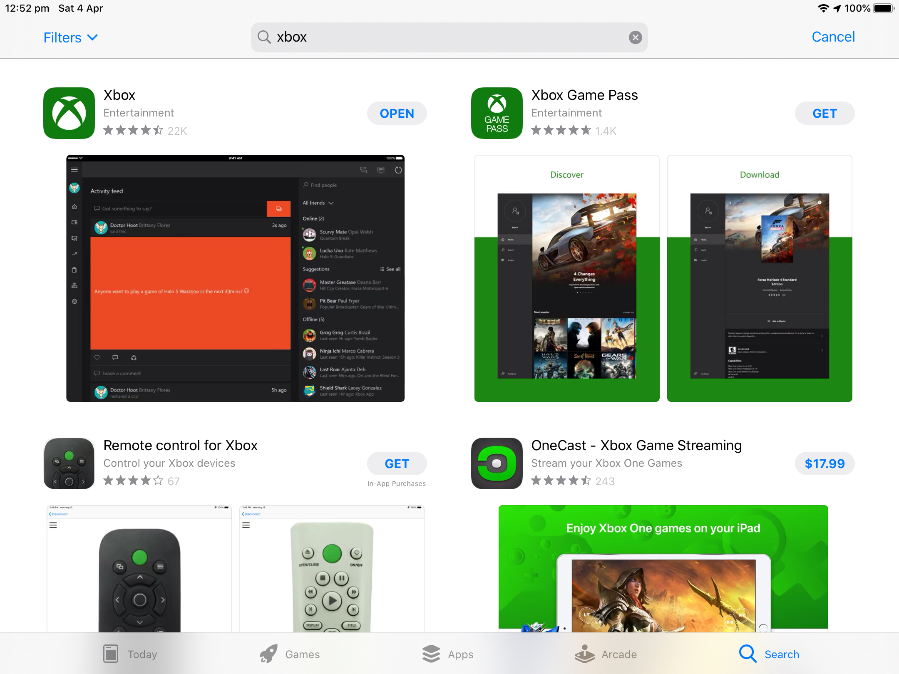
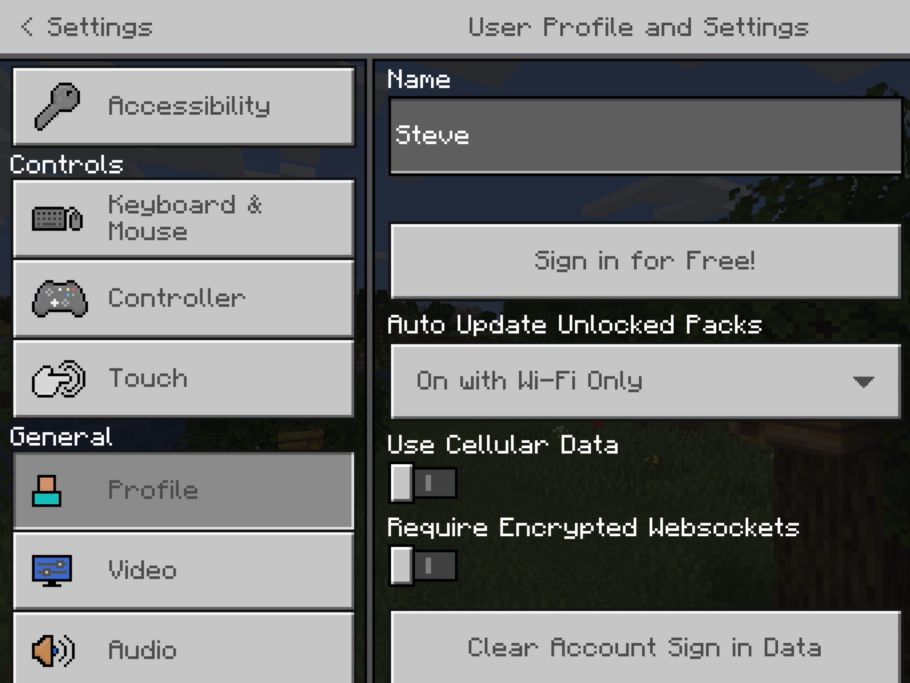
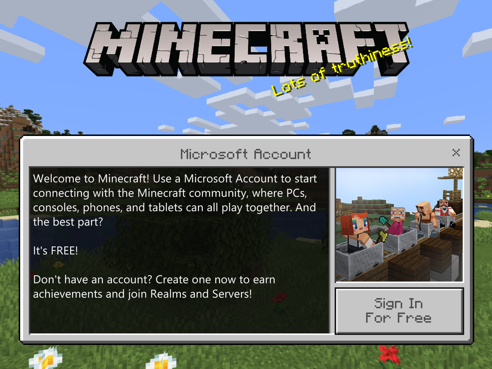
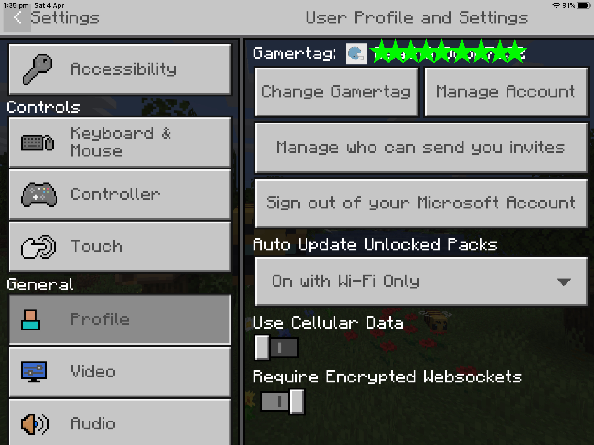

# Setting up a Minecraft Server and connecting iPads

## Which server ?

The kids have iPads and you want to run a Minecraft server.

There are two versions of Minecraft, the original Java one and the newer Bedrock
version released since Microsoft bought Mojang.

iPads are running the Bedrock version so you need the Bedrock version of the server.
https://www.minecraft.net/en-us/download/server/bedrock/

The bad news, if you run a Mac, like I do, there is only a Windows or Ubuntu version available at the moment.
I'm using the Windows version on an old PC.

I'm assuming you have some networking knowledge to get this running.

## Connecting to the server ?

This was rather tricky since I had the kids iPads setup under "Family Sharing" and "Screen Time" was turned on to manage what they did on the iPad.

If you don't know what these are please visit:
https://www.apple.com/family-sharing/
https://support.apple.com/en-au/guide/ipad/ipadb15cb886/ipados

Note:
- the kids iCloud accounts were setup with their own details and correct birthdays.
- the kids XBox accounts were also setup with the own details and correct birthdays.
- family sharing was also setup for the kids XBox accounts, see more details below.

In order to connect Minecraft to the Server, the kids need their own XBox account. This gives them a "Gamertag" and ensures they can login to you Minecraft Server.

### Ensure the kids can run the XBox app

On your iPad, open Settings and go to
- 'Screen Time'
- under 'Family', select the child
- select 'Content & Privacy Restrictions'
- select 'Content Restrictions'. enter the passcode you setup.
- select 'Apps', ensure 12+ is selected otherwise you can't run the XBox App.

Download and install the XBox App on the child's iPad.

### Ensure the XBox app can access the internet

On your iPad, open Settings and go to
- 'Screen Time'
- under 'Family', select the child
- select 'Content & Privacy Restrictions'
- select 'Content Restrictions'. enter the passcode you setup.
- select 'Web Content'
- if you have 'Allowed Websites Only', scroll down to "Add Website"
- Add the website "xbox.com"
- Add the website "microsoft.com"
- Add the website "login.live.com"

### Setting up Minecraft

On the child's iPad
- open Minecraft
- click on 'Settings'
- select 'Profile'

- select 'Sign in for Free!'

- select 'Sign in for Free!' This will open the XBox app and connect to Microsoft.
If you get the message 'Sorry, something went wrong. Give it another try, or try on Xbox.com', see above 'Ensure the XBox app can access the internet' and try again.
- If your child has an XBox account, please sign in, if not, click on 'Create One!' and create an account.
- Once you have an account, you should then get a 'Gamertag', this is name used to identify the users.
- Click on 'Let's Play'
- Your screen should now look like the below image. If you have an error at the top of the screen, see above 'Ensure the XBox app can access the internet'.

### Microsoft Family sharing

Due to the kids ages, Microsoft Family sharing needed to be setup.
By doing this, they can be granted permission to connect to a Minecraft server. Unfortunately, the settings don't seem to allow restrictions to specific servers.

Assuming you have MS Family Sharing setup.
If not, please Google: "microsoft family sharing"

- login to you Microsoft Account https://account.microsoft.com
- click on 'Family'
- Under the childs name, select 'More Options', 'Content Restrictions'
- under 'Apps, Games and Media', set 'Allow apps and games rated for' to '12-year-olds'

This should then allow your child to connect to a server in Minecraft.
